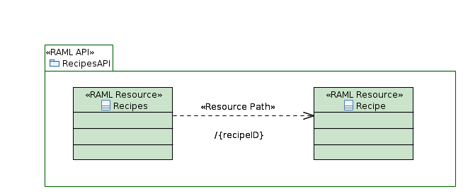
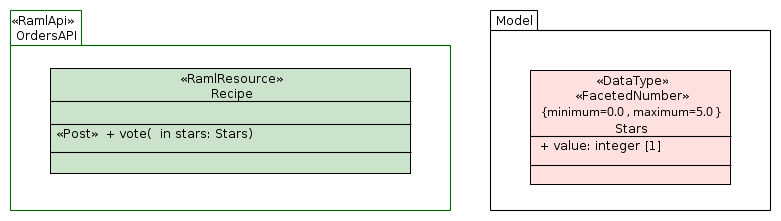
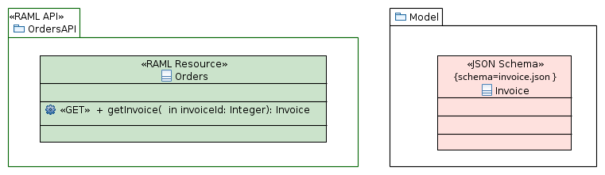
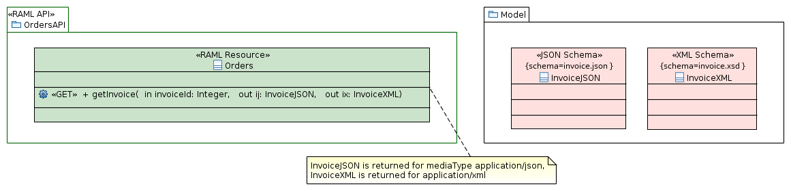

# About

**uml2raml** is a tool to convert a UML class diagram to a [RAML](https://raml.org/) API specification.
It consists of specific stereotypes and a model-to-text generator that transforms a UML model describing a REST API
to a RAML file.

# Index

* [Installation and usage](#installation-and-usage)
* [Tutorial](#tutorial)
* [How-to and best practices](#how-to)
* [FAQ](#faq)
* [Limitations](#limitations)

<a name='installation-and-usage'></a>
# Installation and usage

**uml2raml** can be invoked from you own Java code (see the net.morcilab.uml2raml.m2t.Generate class), as a command line application or as a Maven plugin.

### Command line

The ``uml2raml-{version}-jar-with-dependencies.jar`` file can be produced (under ``target``) by running ``mvn package`` in the uml2raml directory after having cloned the project. Or simply download it from the releases section.
It can be run as:
```
java -jar uml2raml-{version}-jar-with-dependencies.jar model.uml model.raml
```
Run it with no parameters for usage details.

### Maven plugin

To use uml2raml in your own Maven projects, simply paste what follows inside the ``plugins`` section in your ``pom.xml``:
```
<plugin>
    <groupId>net.morcilab.uml2raml</groupId>
    <artifactId>uml2raml-maven-plugin</artifactId>
    <version>1.0.0</version>
    <executions>
        <execution>
    	    <phase>generate-sources</phase>
    		<goals>
    	        <goal>uml2raml</goal>
    		</goals>
        	<configuration>
    	        <verbose>true</verbose>
    			<umlFile>${uml.file}</umlFile>
    			<ramlFile>${raml.file}</ramlFile>
    			<generateDescriptionFiles>true</generateDescriptionFiles>
    			<generateDescriptionPath>${project.build.resources[0].directory}</generateDescriptionPath>
    		</configuration>
    	</execution>
    </executions>
</plugin>
```
and set the ``uml.file`` and ``raml.file`` properties to sensible values (for a more detailed POM file that also includes code generation give a look to [this](#how-to-code) how-to).
It is good practice to store the UML files in ``src/main/resources`` (or a sub-directory) along with the RAML files to be produced (and the external files to be included, if any).

Before using the plugin you must install it in your local Maven repository. To do that run Maven install in the ``uml2raml-maven-pslugin`` project.
Wait! There are prerequisites to that, you should install the raml2uml jars before. To do that run Maven install in the ``uml2raml`` project.
Before that (yes, I'm moving backwards) you should install its dependencies from the UML2 Eclipse project, since they are not pushed to any public repository the easiest way to do it is to run  Maven install from the ``eclipse-uml2-prerequisites`` folder.

To recap:
```
cd eclipse-uml2-prerequisites
mvn install
cd ../uml2raml
mvn install
cd ../uml2raml-maven-plugin
mvn install
```
That's a one-time procedure (unless you delete you local repo).

<a name='tutorial'></a>
# Tutorial

In this tutorial we are going to create a RAML specification for a recipes API. It is assumed that Eclipse and [Papyrus](https://www.eclipse.org/papyrus/) are used to create the UML models and diagrams. At the time of writing the recommended version is Papyrus Neon (so you should install Eclipse Neon and then Papyrus on it). I personally use Oxygen but I learned how to circumvent a few bugs.

#### Setup
[](https://youtu.be/6qfPMZ1kw6Q)

This is more convoluted than if should be, but we have to circumvent a couple of bugs in Papyrus.
The first thing to do is to create a new project in Eclipse. The suggestion here is to create a Maven project if you plan to use Maven or a generic project (``File/New/Project...`` ``General/Project``) otherwise. You could also create a Papyrus project but that way you will also create an initial model that you should delete as soon as the project is created.
So, whatever you do, you should have a brand new project in which you have to put your UML model and the Rest/RAML profiles. When using Maven the right place to store the UML models is ``src/main/resources``, when not using Maven you can use the root folder of the project or, if you prefer, just create a new folder to keep the structure clean.
Now (this is a bug workaround) copy the files from the ``templates/empty_model`` directory (if you cloned the project, otherwise you can find the same files in ``template.zip`` in the releases section). Right click on the ``empty`` model in the Project view (or the ``empty.di`` file in Navigator or Package Explorer) and select ``Rename...`` to rename it to ``recipes`` (you may end up with a ``temp.profile.uml`` file in your project that you can safely delete). This is needed to have an empty UML model with a class diagram in which the profiles are correctly applied and the RAML data types are imported.
Now double click on ``recipes`` (or ``recipes.di``) to open the class diagram and rename it (in the properties view) to ``recipes``.

#### Modeling resources
[](https://youtu.be/6qfPMZ1kw6Q?t=56)

Our API exposes resources to manage a collection of recipes. There are two main resources: the collection of our recipes and the resources themselves.

First of all we should create a package representing our API, we are going to call it ``RecipesApi``. To make clear what this package is about we apply the ``<<RamlApi>>`` stereotype to it.

Now we can set a few properties of that stereotype application. For example we can set:
* ``version`` to ``1``;
* ``mediaType`` to ``application/json``;
* ``baseUri`` to ``http://myrecipes.org/api``.

Also a nice human readable description would be nice but we do not want to clutter this model with long markdown texts so we just set ``description`` to ``!`` that means that the description will be included from an external file that will be created if we transform this UML model to a RAML file with uml2raml.

We are now ready to model our resources so we create two classes in the ``RecipesApi`` package: ``RecipeCollection`` and ``Recipe``. Since these classes are used to model resources we apply them the ``<<RamlResource>>`` stereotype.
Let's now set a few profile application properties for ``RecipeCollection``: 
* ``description`` to ``!`` and 
* ``path`` to ``/recipes``. 

Now it's time for ``Recipe`` but we only set ``description`` here, the path will be obtained by linking ``Recipe`` to ``RecipeCollection`` as a sub-resource. 

To do that we create a dependency link from ``RecipeCollection`` to ``Recipe`` and we call it ``/{recipeID}``, then we apply the ``<<Resource Path>>`` stereotype to the dependency. This mean that to reach a recipe given its ID you should append ``/{recipeID}`` to the path to ``RecipeCollection`` (that we set to ``/recipes``) resulting in the path template ``/recipes/{recipeID}``.

So far so good: we have two resources and we know how to access them. Time to model some methods.

#### Modeling methods and data types
[](https://youtu.be/6qfPMZ1kw6Q?t=278)

Let's start with ``Recipe``, we want to be able to retrieve its content and give it a vote (1 to 5 stars).
To model that we add two operations to the ``Recipe`` class: ``getRecipe`` and ``vote`` and since they will be activated by the GET and POST HTTP methods respectively we apply to them the ``<<Get>>`` and ``<<Post>>`` stereotypes.

Now we need to define what kind of information is returned by invoking ``getRecipe``. Well, this is a recipe, and it is going to have details such as a name, a difficulty level and a list of ingredients. We model that by creating a new class with these properties. 

First of all we keep it all nice and clean by creating a new package (let's call it ``Models``) with a new class to describe the content of a recipe it in (let's call it ``Recipe``). We also apply the ``API Model`` stereotype to this class so that it will appear as a data type in the RAML file. Now we can add a few properties: 
* ``name`` (a string using the ``String`` data type defined in the imported ``PrimitiveTypes`` or a ``string`` using the ``RamlTypes`` data type);
* ``description`` (another string);
* ``difficultyLevel`` (a ``PrimitiveTypes::Integer`` or a ``RamlTypes::integer``, let's keep it simple and ignore constraints on admissible values for the moment);
* ``rating`` (a floating-point number modeled as ``PrimitiveTypes::Real`` or a ``RamlTypes::number``); 
* ``ingredients`` (an array of strings that can be modeled as a string property with multiplicity ``0..*``).

Now we model that ``getRecipe`` returns a recipe by adding it a return parameter of type ``Recipe``.

Things are easier with ``vote``: the request body of the POST has just to carry an integer (the number of stars) and the response can be empty. We model that by adding an in integer parameter ``stars`` to the ``vote`` operation.

[](https://youtu.be/6qfPMZ1kw6Q?t=480)

Time to model the recipes collection; we assume that the operations we want to support are: list recipes matching a given keyword and create a new recipe. These will be mapped to the ``find``, and ``createRecipe`` operations respectively.
We now apply the ``<<Get>>`` stereotype to ``find``, and ``<<Post>>`` to ``createRecipe``.
We also want to model the fact that ``find`` accepts the keyword as a query string parameter; to do that we simply add a ``keyword`` in parameter of type string to the operation. Since ``find`` is a GET HTTP method it does not accept a request body so no misunderstanding is possible: all in (and in-out) parameters are mapped to query parameters.

Time to manage the response produced by ``find``: this is going to be a list of elements containing the name of the recipe matching the keyword and the URI of the corresponding resource (which we model as a simple string).
So we create an ``API Model``-stereotyped class in the ``Models`` package and we name it ``RecipeReference``; we then add to it a couple of string properties: ``name`` and ``uri``. 

It is time to get back to the ``find`` operation and add a return parameter of type ``RecipeReference`` and multiplicity ``0..*``.

[](https://youtu.be/6qfPMZ1kw6Q?t=641)

We still have some work to do on ``createRecipe``: we need do model the request and the response of the corresponding HTTP POST method. The content of the request should be the representation of the recipe to create so we add a ``request`` in parameter of type ``Recipe``. Since this is the one and only in (or in-out) parameter of ``createRecipe`` no further action is required. If we had also query parameters we would had to use the ``<<QueryParameter>>`` and ``<<HttpRequest>>`` stereotypes to distinguish between the two.

Modeling the response is a little more tricky. We want our method to return a ``201`` status code (Created) and a body consisting in the URI of the created recipe resource when the creation is successful. However, if the name of the recipe is already in use, we want to let the creation fail by returning a ``422`` status code (Unprocessable Entity) with an error message as body.
To do that we add to ``createRecipe`` two out string parameters, ``created`` and ``error``, and we assign the stereotype ``<<HttpResponse>>`` to both. By editing the stereotype application parameters we can specify that ``created`` returns a ``201`` status code whereas ``error`` returns a ``422`` code.

That's all folks.

You can use this model as a formal documentation to share within the development team or to expose to API users, or you can transform it in a RAML file (and then produce documentation and code from it).
If you decide to create the RAML file with uml2raml keep in mind that by using the ``-d`` switch (from command line) or the ``generateDescriptionFiles`` property (from Maven) you can instruct the generator to create (empty) description files for all elements whose description is set to ``!`` (just like the ``RecipesApi`` modeled above).

#### Optional refinements
[](https://youtu.be/6qfPMZ1kw6Q?t=757)

Here is a list of a few refinements that we can perform on our model.
First of all when creating a recipe it makes no sense to specify its rating so we can change the multiplicity to ``0..1`` so that it is legal to omit that field in the JSON request to be sent to ``createRecipe``.

We can also constrain the value of the ``stars`` parameter in the ``vote`` operation of ``Recipe``. To so that we need to specify some *facets* on the parameter.
Facets can only be specified for RAML types so the first thing we do here is to make sure that the type of the ``start`` is ``RamlTypes::integer`` (so if you initially modeled it as ``PrimitiveTypes::Integer`` you have now to change it).
Now we apply the ``<<FacetedNumber>>`` stereotype to the parameter and set the stereotype application properties ``minimum`` and ``maximum`` to ``0`` and ``5`` respectively.

Resource types and traits are some of the best features of RAML so you may want to take advantage from them. Suppose we want to specify that the access to the ``vote`` operation is secured (meaning that an access token has to be obtained and presented for each invocation in the ``access_token`` header).
Instead of forcing this kind of details in the UML model we can use traits. We can create a ``traits/secured.raml`` containing:
```
usage: Apply this to any method that needs to be secured
description: Some requests require authentication.
headers:
  access_token:
    description: Access Token
    example: 5757gh76
    required: true
```
(this is an example from RAML's specs) and include the trait in our model by adding the item ``secured: !include https://pattern.yaas.io/v1/trait-restricted.yaml`` to the ``traits`` property of the ``<<RamlApi>>`` stereotype application in the ``RecipesAPI`` package.
Now we can set to ``[ secured ]`` the ``is`` property of the ``<<Post>>`` stereotype application in the ``vote`` operation.

Similarly we can use resource types with the ``resourceTypes`` property of the ``<<RamlApi>>`` stereotype and the ``type`` property of the ``<<RamlResource>>`` stereotype.

#### Producing a RAML file

Producing the RAML file by using the command line version of uml2raml is as simple as running
```
java -jar uml2raml-{version}-jar-with-dependencies.jar recipes.uml -v -d recipes.uml recipes.raml
```

[](https://youtu.be/6qfPMZ1kw6Q?t=997)

If you are using Maven create a new project and adjust the POM as discussed [above](#installation-and-usage). If you also want to generate JAX-RS code using raml-to-jax-rs then copy the ``pom.xml`` linked in [this](#how-to-code) how-to and paste it right below the packaging entry in your POM. Adjust as needed (follow the instructions in the comments) and run ``mvn generate-sources``.

<a name='how-to'></a>
# How-to and best practices

#### Linking resources with navigation links

Although you can separately set a path for all your ``<<Resource>>`` (or ``<<RamlResource>>``) classes, you can also link hierarchies of resources using ``<<ResourcePath>>`` stereotyped dependencies.
Suppose you have a collection of recipes accessible as ``/recipes`` with single recipes accessible as ``/recipes/{recipeID}``. You can model that with two resource classes ``Recipes`` and ``Recipe`` and set their respective ``path`` stereotype properties to ``/recipes`` and ``/recipes/{recipeID}`` or you can set the full path only for ``Recipes`` and connect ``Recipes`` to ``Recipe`` with a ``<<ResourcePath>>`` stereotyped dependency with name ``/{recipeID}`` (alternatively you can use ``<<ResourcePath>>``'s ``path`` property). This usually improves the readability of resources hierarchies. Notice that this results in a RAML specification in which the second resource is modeled as a sub-resource.



#### Using facets

Facets can be used to constraint the value of a type. In the profile they translate into stereotypes (``FacetedNumber``, ``FacetedString``, ...) that can be applied to ``ApiModel`` properties and to HTTP methods parameters (like the ``stars`` parameter in the ``vote`` method in the tutorial). This application, however, cannot be shown in the diagram. To improve the readability of the model the suggestion is to apply these stereotypes to ``DataType`` elements (they look like classes and are available from the nodes palette). These special data types should contain only one property of the desired type. The application of the stereotypes facets to this type will create a new RAML type that can be referenced in the model. To get back to the example in the tutorial: instead of applying the ``FacetedNumber`` stereotype to the ``stars`` parameter to limit its range to 0..5 (which is something that cannot be shown in the model) we can create a new ``Stars`` data type with a single ``value`` property (the name is totally irrelevant) of type ``RamlTypes::integer`` and apply the ``FacetedNumber`` stereotype to that data type to create a new RAML type ``Stars`` that corresponds to an integer with a range 0..5. Now we can edit the ``vote`` method so that it accepts a ``Stars`` parameter.



#### Modeling a method that returns a JSON conforming to a schema

Say you have a schema for an invoice request in ``invoice.json``, create a ``<<JsonSchema>>`` stereotyped class with name ``InvoiceJSON`` and set the ``schema`` stereotype property to ``invoice.json``. Now just let your method return a ``InvoiceJSON`` type and you are all set.



#### Modeling a method that returns an XML conforming to a schema

See the previous recipe and use the ``<<XmlSchema>>`` stereotype instead of ``<<JSON Schema>>``

#### Modeling a method that returns response bodies with different media types

Non-stereotyped return (or out or in-out) parameters are assumed to model responses with the default media type set for the API. If you want a response with a different media type or even multiple responses with various media types you can apply the ``<<HttpResponse>>`` stereotype to the parameters and set stereotype's ``mediaType`` property accordingly. In case of multiple response parameters I suggest to model them as out parameters instead as return ones (yes, it's possible to have multiple return parameters in UML) in order to improve readability. Sadly there no way to see that in the diagram in Papyrus. Careful choice of parameters name usually is sufficient, as a last resort you can add a note to the diagram.



#### Modeling a method that accepts request bodies with different media types

Similarly for what is described above about responses, multiple requests bodies with different media types can be modeled by applying the ``<<HttpRequest>>`` stereotype to methods in and in-out parameters and specifying the ``mediaType`` stereotype property.

#### Modeling query parameters (query strings)

In non request body-supporting methods (such as GET and HEAD) all in and in-out parameters of a method are assumed to be query parameters so you do not need any further intricacy. In methods (such as POST and PUT) that accept a request body you must distinguish in and in-out parameters that represent request bodies from parameters that represent query parameters by applying the ``<<QueryParameter>>`` stereotype to the latter.

#### Resource types and traits

Traits to be applied to a model must be stored in external files. They can be included using the ``traits`` property of the ``<<RAML API>>`` stereotype that is applied to the package describing the API.
To assign a trait to a method just set the ``is`` property of the corresponding ``<<RamlMethod>>`` stereotype (you will be probably using one if its sub-stereotypes like ``<<Get>>`` and ``<<Post>>``).
When creating a RAML file uml2raml just outputs the list of string values the ``traits`` property is set to, right after the ``traits:`` key in the RAML file. So if you want to import a key-less list of trait files you should prepend them with an hyphen (e.g. ``- !include traits/restricted.yaml``); if you want to import a list of trait files specifying their keys you should set the ``traits`` entries accordingly (e.g. ``restricted: !include traits/restricted.yaml``). You cannot mix the twos (this is a RAML limitation).
Operating with resource types is very similar. Import the types definition files using the ``resourceTypes`` property of the ``<<RamlApi>>`` stereotype that is applied to the package describing the API. Apply the types to the resources by setting the ``type`` property of their ``<<RamlResource>>`` stereotype application.

<a name='how-to-code'></a>
#### Producing code with Maven

Once your RAML file is created it can be used for multiple purposes (build, test, document and share as suggested in raml.org). If your goal is to create the skeleton of a JAX-RS application to deploy your API a great tool is [raml-to-jax-rs](https://github.com/mulesoft-labs/raml-for-jax-rs/blob/master/raml-to-jaxrs/).
If you want to create a model-driven transformation chain UML &rarr; RAML &rarr; JAX-RS in your Maven project then this [pom.xml](templates/pom-raml2jaxrs-xml) is a good starting point.

<a name='faq'></a>
# FAQ

#### Is all that Papyrus-only?

Profiles have been designed with Papyrus but they should be standard XMI stuff so there is no reason to believe they do not work with other UML modelers. The same applies to the UML API models. But all this is untested (it is in the to-do pipeline, though).

#### How do I install Papyrus?

The most basic procedure for installing Papyrus is described in the "Setup Papyrus with Update Sites" section [here](https://www.eclipse.org/papyrus/download.html).

#### Should I use RestProfile or RamlProfile?

If you want to produce a RAML specification from your UML model then RamlProfile is probably your best bet. RestProfile should only be used for very generic models that are not meant be used in a model transformations chain.

#### How do I set the value of a property of a stereotype?

For elements such as packages and classes just select the element and click on the ``Profile`` tab in the ``Properties`` view. From there you can see a list of the stereotypes applied to the element. To edit the properties of a stereotype just click on the small triangle to the left of the name of the stereotype. If no triangle appears it simply means that the stereotype has no properties. For setting the properties of a stereotype applied to a method see the specific FAQ.

#### How do I set the value of a property for a stereotype applied to a method?

Select the method. In the properties panel, ``Profile`` tab, you are shown the ``Applied stereotypes`` section which contains a list of the applied stereotypes. To edit the parameters for an applied stereotype just click on the triangle to the left of its name.

#### How do I apply a stereotype to a method's parameter?

Select the method. In the properties panel (``UML`` tab) you will find an ``Owned parameters`` section. Here you can add/edit/remove the parameters for the method. To apply a stereotype you must first create the parameter, then you have to edit (just double-click it) and you will see a ``Profile`` tab in the bottom of the ``Edit Parameter`` dialog.

#### How do I set values for String[*] stereotype properties (like RamlApi::traits)?

``RamlApi::traits``, ``RamlApi::types``, ``RamlApi::resourceTypes``, ``RamlApi::uses`` and other similar properties are modeled as arrays of strings with the assumption that their only allowed use is to include some external definition.
So if you want to include in your API traits for secured and rate-limited methods you should set the ``RamlApi::traits`` to ``["secured: !include traits/secured.raml", "rateLimited: !include traits/rate-limited.raml"]`` if the external RAML traits files are keyless or to ``["- !include traits/secured.raml", "- !include traits/rate-limited.raml"]`` if the external RAML files include the key declaration.

<a name='faq-headers'></a>
#### How do I specify headers?

You might have seen that there is a ``headers`` field in the ``HttpMethod``-derived stereotypes (that includes ``<<Get>>``, ``<<Post>>`` and friends). This is not supported by the generator, mainly because when you try to set the type of the header in Papyrus you are presented with an empty types list. That being said I would really urge you not to clutter your model with such low-level details. I would not specify them in the main RAML file anyway. Headers should be specified in traits included from external files, and the traits should be associated to the methods using the ``is`` stereotype parameter.

<a name='limitations'></a>
# Limitations

* Type inheritance is not supported (but is planned)
* Annotation facets are not supported (so is the ``annotationTypes`` facet)
* User-defined facets in type declarations are not supported.
* Union types are not supported.
* RAML specifications can declare types in many different places (the so called in-line type declarations), we assume the most basic usage: when you need to reference a type this is either a "basic" type (that technically is a type in UML's ``PrimitiveTypes`` or a type in ``RAML types``) or a reference to an ``<<ApiModel>>`` (that results in the declaration of an object type). Because of that, for example, there is no way to attach a description to a single property of an object type (since descriptions are mapped to the ``description`` property of the ``<<ApiModel>>`` stereotype so they can only be set for the whole object).
* The emun facet in only supported for string elements. To specify that a string property of an ApiModel or a string  parameter in a method are restricted to a set of values (e.g. "low", "medium", and "high") you need to apply the ``FacetedString`` stereotype to the property or the parameter and set the ``enum`` stereotype property (to ``[ low, medium, high ]`` in our example).
* Headers are not supported by the generator (although they are defined in the UML RAML profile. See also [this](#faq-headers) FAQ.
* There is no way to declare elementary RAML types, so for example you cannot model the declaration of a type ``birthday`` that is an alias for ``date-only``. If you need that you should declare ``birthday`` in an external file and import it using the ``types`` parameter of the ``<<RamlApi>>`` stereotype.
* Multiple operations stereotyped with the same HTTP method lead to the creation of an invalid RAML file. It would be possible to support multiple, say, POST operations as long as they accept different mediaTypes. This is unsupported in the current release.

